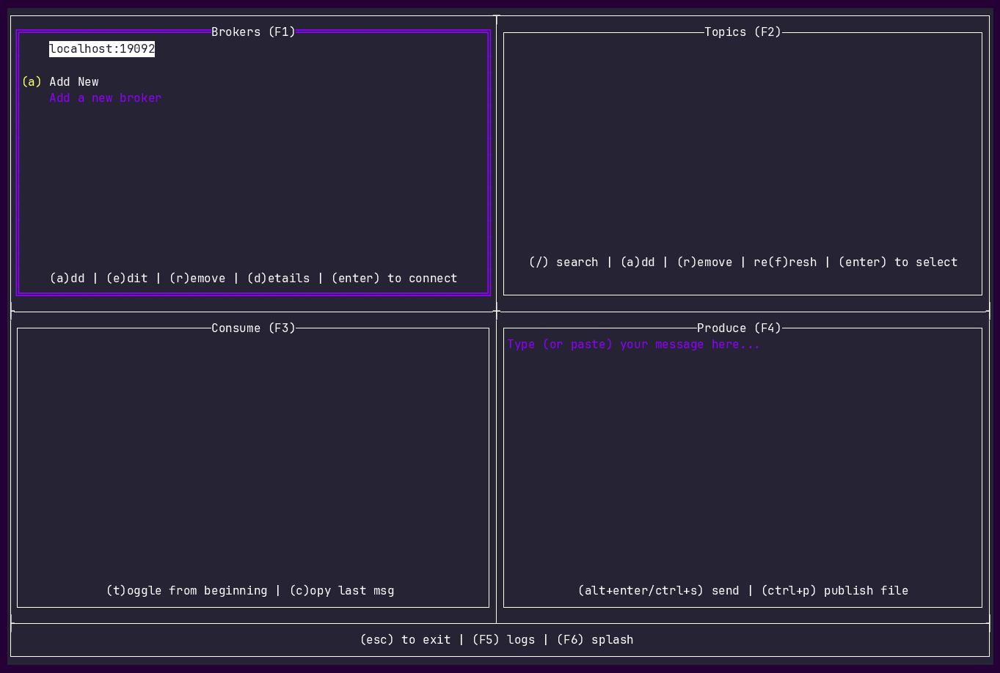

# lazykafka

```
░▒▓█▓▒░       ░▒▓██████▓▒░░▒▓████████▓▒░▒▓█▓▒░░▒▓█▓▒░              
░▒▓█▓▒░      ░▒▓█▓▒░░▒▓█▓▒░      ░▒▓█▓▒░▒▓█▓▒░░▒▓█▓▒░              
░▒▓█▓▒░      ░▒▓█▓▒░░▒▓█▓▒░    ░▒▓██▓▒░░▒▓█▓▒░░▒▓█▓▒░              
░▒▓█▓▒░      ░▒▓████████▓▒░  ░▒▓██▓▒░   ░▒▓██████▓▒░               
░▒▓█▓▒░      ░▒▓█▓▒░░▒▓█▓▒░░▒▓██▓▒░       ░▒▓█▓▒░                  
░▒▓█▓▒░      ░▒▓█▓▒░░▒▓█▓▒░▒▓█▓▒░         ░▒▓█▓▒░                  
░▒▓████████▓▒░▒▓█▓▒░░▒▓█▓▒░▒▓████████▓▒░  ░▒▓█▓▒░                  
                                                                   
                                                                   
░▒▓█▓▒░░▒▓█▓▒░░▒▓██████▓▒░░▒▓████████▓▒░▒▓█▓▒░░▒▓█▓▒░░▒▓██████▓▒░  
░▒▓█▓▒░░▒▓█▓▒░▒▓█▓▒░░▒▓█▓▒░▒▓█▓▒░      ░▒▓█▓▒░░▒▓█▓▒░▒▓█▓▒░░▒▓█▓▒░ 
░▒▓█▓▒░░▒▓█▓▒░▒▓█▓▒░░▒▓█▓▒░▒▓█▓▒░      ░▒▓█▓▒░░▒▓█▓▒░▒▓█▓▒░░▒▓█▓▒░ 
░▒▓███████▓▒░░▒▓████████▓▒░▒▓██████▓▒░ ░▒▓███████▓▒░░▒▓████████▓▒░ 
░▒▓█▓▒░░▒▓█▓▒░▒▓█▓▒░░▒▓█▓▒░▒▓█▓▒░      ░▒▓█▓▒░░▒▓█▓▒░▒▓█▓▒░░▒▓█▓▒░ 
░▒▓█▓▒░░▒▓█▓▒░▒▓█▓▒░░▒▓█▓▒░▒▓█▓▒░      ░▒▓█▓▒░░▒▓█▓▒░▒▓█▓▒░░▒▓█▓▒░ 
░▒▓█▓▒░░▒▓█▓▒░▒▓█▓▒░░▒▓█▓▒░▒▓█▓▒░      ░▒▓█▓▒░░▒▓█▓▒░▒▓█▓▒░░▒▓█▓▒░
```

**Lazykafka** is a lightweight Terminal User Interface (TUI) designed to simplify the management and monitoring of Apache Kafka clusters. It provides an intuitive, keyboard-driven dashboard for visualizing broker status, inspecting topics, and tracking partition metadata without leaving the command line. The tool streamlines development workflows by allowing users to easily create or delete topics, produce test messages, and consume live data streams in real-time. Built for efficiency, Lazykafka offers a "relaxed" yet powerful alternative to complex CLI commands for developers and SREs.

**tl;dr**

 - connect to broker (connection params persisted)
     - inspect broker state: topic offsets, consumer groups (removal possible) and cluster config
 - list, add and remove topics
 - read from topics (with an option to start from beginning)
 - publish to topics (including publishing content from file with convinient file browser embedded into lazykafka)

**disclaimer**

Lazykafka is designed for quick observability, not heavy lifting. We intentionally skip consumer groups and offset tracking, so you can peek into your streams without joining a group or "stealing" messages from your actual consumers. It's a transparent window into your cluster that leaves no footprints

# Features Demo

Here is a showcase of the main features in LazyKafka.

## Connecting and Managing Brokers
Easily connect to your cluster from the start. You can also add new brokers seamlessly – and all your configurations are automatically persisted across your sessions!



## Navigating and Managing Topics
Easily scroll through topics, use `/` to filter them dynamically, and instantly add or remove topics using the modal.


## Live Consumption & Clipboard Integration
Select a topic and watch messages stream in live. Hit `c` to instantly copy the last consumed message directly to your system clipboard for easy sharing or analysis!


## Producing Messages
Quickly produce JSON messages directly to your selected topic. You can type data inline in the editor, or use the built-in file picker (`Ctrl+P`) to load larger payloads from disk!


## Broker & Cluster Details
Inspect broker configurations, verify consumer groups (and quickly delete idle ones with `r`), and view offsets by opening the cluster state panel (`d`). Note how you can effortlessly carousel through the sub-panes.


## Internal Logs
Press `F5` anytime to see application logs and check connection status and internal events.


# Installation
**Homebrew (macOS/Linux**)

    brew tap dubel/tap
    brew install lazykafka

**Linux (Debian/Ubuntu)**
Go to the releases page of this repo (https://github.com/dubel/lazykafka/releases), download the .deb file, and run:

    sudo dpkg -i lazykafka_*.deb

**Linux (RHEL/CentOS/Fedora)**
Go to the releases page, download the .rpm file, and run:

    sudo rpm -ivh lazykafka_*.rpm

**Linux (Arch Linux)**
Go to the releases page, download the .pkg.tar.zst file, and run:

    sudo pacman -U lazykafka_*.pkg.tar.zst

### Running in a Container

If you want to run Lazykafka directly within your Docker or Kubernetes cluster to easily resolve internal service names and connect to your Kafka brokers without exposing them externally, you can use the following one-line commands. 

Since these commands run interactively (`-it`), **they will immediately open the Lazykafka TUI** in your terminal. Once you quit the application, the ephemeral container/pod will be automatically removed (`--rm`).

**Docker / Docker Swarm**
```bash
docker run -it --rm --network=<your_network_name> ghcr.io/dubel/lazykafka
```
*(Tip: You can find your network name by running `docker network ls`. Use the network that your Kafka brokers are attached to.)*

**Kubernetes**
```bash
kubectl run lazykafka -it --rm --image=ghcr.io/dubel/lazykafka --restart=Never
```
*(Tip: In Kubernetes, you don't need to specify a network. The pod automatically uses the cluster's internal DNS. If your Kafka cluster is in a specific namespace, just append `-n <namespace>` to the command.)*

**(Optional) Logging into a Shell**

If you prefer to start a shell inside the container (e.g., for debugging) and trigger `lazykafka` manually, you can override the default command/entrypoint:

**Docker:**
```bash
docker run -it --rm --entrypoint sh --network=<your_network_name> ghcr.io/dubel/lazykafka
```

**Kubernetes:**
```bash
kubectl run lazykafka-shell -it --rm --image=ghcr.io/dubel/lazykafka --restart=Never --command -- sh
```

### Running a Persistent Container (Background)

If you'd prefer to keep a persistent jumpbox container always running in your cluster so you can quickly log into it whenever needed, you can deploy a container that runs in the background and `exec` into it to trigger the TUI.

#### Kubernetes

1. **Deploy the persistent pod:**
   ```bash
   kubectl run lazykafka-persistent --image=ghcr.io/dubel/lazykafka --restart=Always --command -- sleep infinity
   ```

2. **Access the TUI anytime:**
   ```bash
   kubectl exec -it lazykafka-persistent -- lazykafka
   ```

#### Docker / Docker Swarm

1. **Deploy the persistent container** (attached to your network):
   ```bash
   docker run -d --name lazykafka-persistent --network=<your_network_name> --entrypoint sleep ghcr.io/dubel/lazykafka infinity
   ```
   *(Note: For Docker Swarm, running this standard container on a node with access to your overlay network is usually the simplest way to maintain a persistent entrypoint).*

2. **Access the TUI anytime:**
   ```bash
   docker exec -it lazykafka-persistent lazykafka
   ```
